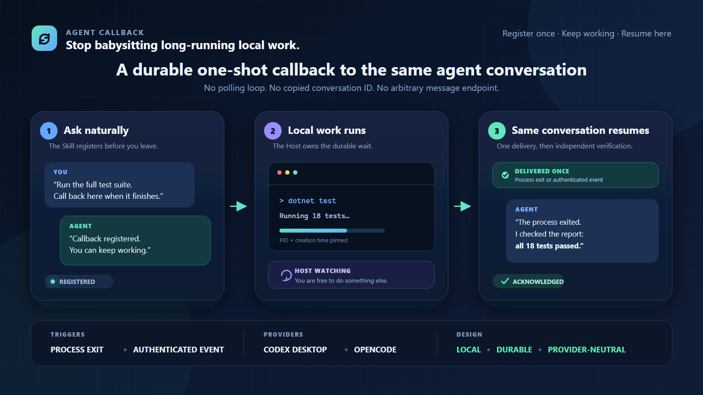

# Agent Callback

**Stop babysitting long-running local work.**

Agent Callback is a small, provider-neutral Windows and Linux app that lets a coding agent leave a durable, one-shot reminder for itself. When a process exits or a local program reports completion, the callback returns to the same conversation so the agent can verify the result and continue.



## The short version

1. Ask your agent to call back when local work finishes.
2. The installed Skill registers one callback for this conversation.
3. The per-user Host watches the process or waits for an authenticated event while you do something else.
4. Completion wakes the same conversation once. The agent checks the evidence, continues the stored instruction, and acknowledges the callback.

There is no general-purpose message endpoint: the program that finishes cannot change the saved instruction or redirect the callback to another conversation.

## Try it from your agent

After installing and restarting your supported agent, ask naturally:

> Run the full build. Use Agent Callback to return to this conversation when the process exits, verify the result, and continue.

The agent uses the installed Skill to register the callback. You do not need to copy a conversation ID or keep the current turn open.

A typical flow looks like this:

```text
You:    Run the full test suite. Call back here when it finishes.
Agent:  The test process is running and callback acb_... is registered.

        ...you keep working elsewhere...

Callback: [agent-callback:v1:acb_...]
Agent:  The process exited. I checked the test report: all 18 tests passed.
```

Process exit is only a wake-up signal. Because an external watcher usually cannot recover a reliable exit code, the resumed agent must inspect the output or other evidence before claiming success.

## Choose a trigger

| Trigger | Use it when | What happens |
| --- | --- | --- |
| **Process** | A build, test, download, analysis, or other stable process is already running | The Host pins the PID, creation time, and optional command marker, then makes the callback ready after that exact process exits. |
| **Event** | You control the program that knows its own final result | Registration returns a one-time secret. The program may trigger the callback with a bounded outcome, exit code, summary, and allowlisted evidence references. |

Both triggers are durable across Host restarts and deliver at most one stored continuation.

## Supported agents

| Provider | Status | Delivery behavior |
| --- | --- | --- |
| **Codex Desktop on Windows** | Experimental | Steers an active turn or starts an idle follow-up in the registered task. |
| **Codex CLI on Linux** | Experimental | Uses the official shared app-server Unix socket to steer or start a turn in the exact thread. Launch the session with `agent-callback codex`. |
| **OpenCode on Windows/Linux** | Experimental | Uses an owned plugin to identify the exact OpenCode instance and session, then posts an idle follow-up through OpenCode's public loopback API. |

The Codex adapters do not use a package-version allowlist. They probe the current endpoint and operation directly. On Linux, a normally launched private TUI is intentionally unavailable because an external process cannot safely steer its in-process owner. `agent-callback codex` starts/probes Codex's shared app-server and launches `codex --remote unix://` with an exact connection target.

The OpenCode plugin accepts only loopback server origins and sends its password to the Host over stdin. The Host protects it with current-user DPAPI on Windows or AES-256-GCM under a private per-user key on Linux. Restart OpenCode after installation, then run `agent-callback provider status opencode`.

Claude Code is not advertised as supported. Its official CLI resume path launches a separate headless client, while Claude Desktop keeps separate session history. See [the transport decision](docs/claude-code-transport-decision.md).

Additional agents can be added behind the narrow `IAgentProvider` boundary. Callback storage and trigger handling do not depend on Codex or OpenCode.

## Install on Windows

The `0.1.0-alpha.4` release includes Windows x64 and Linux x64 packages.

1. Download `agent-callback-0.1.0-alpha.4-win-x64.zip` and its `.sha256` sidecar from [GitHub Releases](https://github.com/BIOcanse/agent-callback/releases).
2. Verify the archive checksum and extract the ZIP.
3. Run:

```powershell
powershell.exe -NoProfile -ExecutionPolicy Bypass -File .\install.ps1
```

No administrator privileges are required. The installer adds:

- App: `%LOCALAPPDATA%\Programs\AgentCallback`
- callback data: `%LOCALAPPDATA%\AgentCallback`
- Codex Skill: `%USERPROFILE%\.codex\skills\agent-callback`
- OpenCode Skill: `%USERPROFILE%\.config\opencode\skills\agent-callback`
- OpenCode plugin: `%USERPROFILE%\.config\opencode\plugins\agent-callback.js`
- per-user startup value: `HKCU\Software\Microsoft\Windows\CurrentVersion\Run\AgentCallback`
- Windows uninstall entry: `HKCU\Software\Microsoft\Windows\CurrentVersion\Uninstall\AgentCallback`

The installed Skill receives a generated `references/app-installation.json` with the exact executable, data, Skill, plugin, registry, and uninstall locations for that machine. This lets the agent diagnose or cleanly uninstall Agent Callback without guessing paths.

Restart Codex so it discovers the Skill, and restart OpenCode so it loads the plugin. The Host starts for the current session and automatically at the next user login.

## Install on Linux

Download `agent-callback-0.1.0-alpha.4-linux-x64.tar.gz` and its `.sha256` sidecar, verify it, and run:

```bash
sha256sum --check agent-callback-0.1.0-alpha.4-linux-x64.tar.gz.sha256
tar -xzf agent-callback-0.1.0-alpha.4-linux-x64.tar.gz
cd agent-callback-0.1.0-alpha.4-linux-x64
bash install.sh
```

No root privileges are required. The installer adds the App under `~/.local/lib/agent-callback`, a command symlink under `~/.local/bin`, both provider Skills, the owned OpenCode plugin, and `~/.config/systemd/user/agent-callback.service`. Callback state defaults to `${XDG_STATE_HOME:-$HOME/.local/state}/agent-callback`; the directory is `0700` and its encryption key is `0600`.

Restart OpenCode once after installation. For a callback-capable Codex CLI session, use:

```bash
agent-callback codex
```

This is still the native Codex CLI; the launcher only attaches it to Codex's official per-user shared app-server. WSL 2 with systemd is supported. As with other WSL user services, Windows must start the distribution before its user manager can run.

This project is not affiliated with or endorsed by OpenAI or any agent vendor.

## Uninstall

On Windows, use **Installed apps** or the exact `uninstallCommand` recorded by the installed Skill. On Linux, run the recorded `~/.local/lib/agent-callback/uninstall.sh`.

Normal uninstall removes the App, both owned Skill copies, the owned OpenCode plugin, startup entry, and uninstall entry. It preserves callback history. To erase callback data too, explicitly run:

```powershell
powershell.exe -NoProfile -ExecutionPolicy Bypass -File "$env:LOCALAPPDATA\Programs\AgentCallback\uninstall.ps1" -RemoveData
```

Data removal is ownership-checked, path-bounded, and never implied by a normal uninstall.

The Linux equivalent is:

```bash
~/.local/lib/agent-callback/uninstall.sh --remove-data
```

## Safety model

- One callback, one stored continuation, one registered conversation.
- Process callbacks reject PID reuse by checking process creation time.
- Event callbacks require a per-callback secret and accept only bounded result metadata.
- A possible-write timeout is terminally ambiguous and is not automatically retried through another path.
- Continuation instructions are protected with current-user DPAPI on Windows or AES-256-GCM plus a private per-user file key on Linux.
- No arbitrary send-message API, scheduler, recurring jobs, agent teams, UI automation, transcript mutation, or public TCP listener.

## CLI reference

Agents normally use the installed Skill and its machine-specific App record. The CLI is also available for direct integration and diagnosis:

```text
agent-callback host start
agent-callback provider status codex
agent-callback provider status opencode

# Linux only: launch Codex in its supported shared app-server mode.
agent-callback codex

# Wake when one exact process exits.
agent-callback register process --provider codex --pid 1234 --instruction "Verify the result and continue."

# Let a trusted local program report its own completion.
agent-callback register event --provider codex --instruction "Verify the result and continue."
agent-callback trigger <callback-id> --secret <one-time-secret> --outcome succeeded --exit-code 0 --summary "Export finished"

agent-callback get <callback-id>
agent-callback list
agent-callback cancel <callback-id>
agent-callback acknowledge <callback-id>
agent-callback version
```

Keep event secrets out of logs, source control, callback labels, summaries, and instructions. `CODEX_THREAD_ID` supplies the Codex thread; the Linux launcher adds the exact app-server connection. The OpenCode plugin supplies its provider and opaque target through `AGENT_CALLBACK_PROVIDER` and `AGENT_CALLBACK_TARGET_ID`.

## Build and test

Requires .NET SDK 10. Windows builds both target frameworks and cross-publishes the self-contained Linux artifact; WSL supplies the permission-preserving `tar` step:

```powershell
dotnet test AgentCallback.slnx
dotnet format AgentCallback.slnx --verify-no-changes --no-restore
powershell.exe -NoProfile -ExecutionPolicy Bypass -File packaging\windows\publish.ps1
powershell.exe -NoProfile -ExecutionPolicy Bypass -File packaging\linux\publish.ps1
```

The publish scripts create self-contained ZIP or `tar.gz` packages under `artifacts/`, including the App, installer, uninstaller, Skill, OpenCode integration, documentation, executable checksum, and release-side archive checksum.

Architecture and transport details are in [the product plan](docs/product-plan.md), [the Codex transport decision](docs/transport-decision.md), and [the OpenCode transport decision](docs/opencode-transport-decision.md).

## License

Apache-2.0. See [LICENSE](LICENSE).
