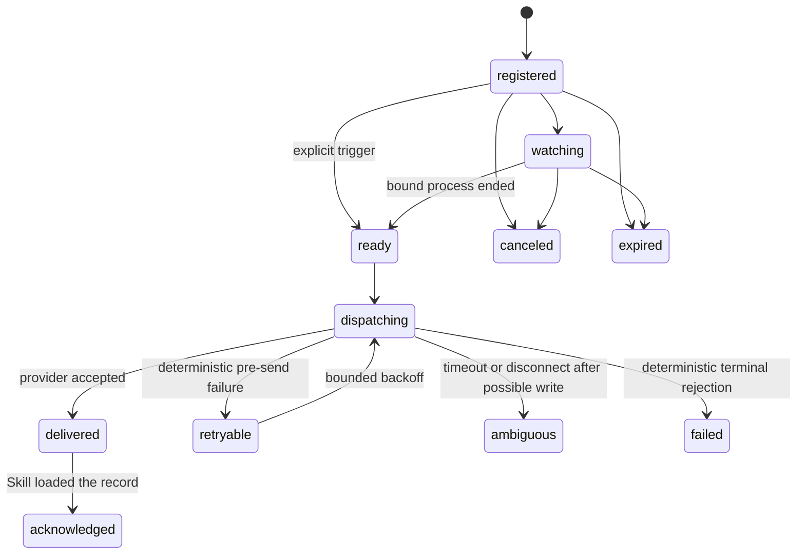
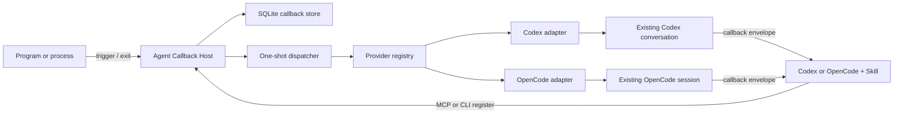

# Agent Callback 独立产品方案

日期：2026-07-20
状态：`0.1.0-alpha.5` 已实现（alpha.4 已通过 Windows/WSL 发布门禁；alpha.5 修复空闲线程投递并加入所有者窗口重定位）

## 结论

发布一个独立、开源、只负责一次性回调的 provider-neutral 本地产品 **Agent Callback**。Codex Desktop 是首个适配器，OpenCode 是第二个适配器；两者都不是产品品牌或核心模型依赖。

首版只解决这一件事：程序或长时间进程结束后，可靠地向已经登记的原 Agent 对话提交一条预先授权的后续消息，让同一个任务恢复处理。

它不是 Codex Thread Automation 的精简皮肤，也不包含定时任务、循环调度、Team、规则引擎、任务看板、配额管理或通用 Agent 控制台。现有 Codex Thread Automation 只作为已经验证过的代码与故障语义来源；新产品独立安装、独立存储、独立运行。

对外发布时采用两部分、同版本交付：

1. 一个本地原生 App，提供耐久回调、进程监听、Provider Registry、CLI 和本地 MCP 服务；
2. 面向具体 Agent 的集成包；当前包含 Codex/OpenCode Skill、Codex 适配器和 OpenCode 插件。

Codex 官方当前把 Plugin 作为可安装和发布单元，Plugin 可以同时包含 MCP-backed App 与 Skills。因此，对用户呈现为一个 Plugin，对本机运行则由轻量原生 Host 承担可靠性。

## 产品定位

一句话定位：

> Durable one-shot callbacks into coding-agent conversations.

显示名、仓库、协议和可执行文件统一使用中性的 `Agent Callback` / `agent-callback`。Codex 只出现在 Provider 能力与兼容性说明中，避免产品名称让人误以为是 OpenAI 官方组件，并为以后增加允许程序发送消息的开源 Agent 保留清晰边界。

它与相邻产品的区别不是“能发送一条消息”，而是以下组合：

- 回到用户已经在使用的原对话，而不是新建一个被本产品托管的 Agent；
- 先登记后触发，程序不能在触发时任意注入新指令；
- 一次性、耐久、幂等，能够跨 Host 或 Codex Desktop 短暂重启恢复；
- 明确区分“进程结束”“消息被 Codex 接受”“Codex 已处理”三个事实；
- 由 Skill 负责正确登记和正确消费回调，App 负责状态、监听和投递。

市场上已有 AgentAPI、Polpo、amux 等 Agent 控制面或终端包装器，也有 Pi RPC 这类原生支持 `steer`/`follow_up` 的 Agent 协议；因此不能宣传成“没有任何相似产品”。目前没有发现与本方案完全相同、以“预登记的一次性耐久回调 + 原 Codex Desktop 对话 + 配套 Skill”为唯一核心的成熟产品。这才是准确的差异化表述。

## 首版用户流程

### Codex 监听长进程

1. 用户明确要求“后台运行，结束后回调这个任务”。
2. Skill 检查 App、Codex Provider 和当前线程标识是否可用。
3. Codex 启动一次长进程，并把稳定的外层 PID、创建时间、命令标记、状态文件和后续指令登记给 App。
4. App 返回回调 ID；Codex 报告 ID 后结束当前轮，不继续轮询或等待。
5. App 观察到绑定的进程结束，保存完成证据，并尝试向原 Codex 对话投递回调信封。
6. 若原对话空闲，开始普通 follow-up；若原对话仍在运行，向当前轮 steer；若投递结果不确定，不跨路径重试。
7. 收到回调的 Codex 由 Skill 读取登记记录和状态文件，验证实际结果，然后继续原任务。

### 任意本地程序主动触发

1. Codex 或用户先创建一个 `event` 回调，固定目标对话和后续指令。
2. App 返回回调 ID 和仅用于该回调的触发凭据。
3. 程序结束时调用 `agent-callback trigger <id>`，只提交结果元数据和证据引用。
4. App 发送登记时已经固定的消息。触发程序不能替换目标对话或主要指令。

这个“先登记、后触发”的约束是产品边界，也是默认安全模型。首版不提供面向任意程序的通用 `send-message` API。

## 明确不做

首版不包含：

- recurring、cron、延时计划或零间隔循环；
- Agent Team、任务队列、全局任务、规则脚本和工作流 DAG；
- 配额检测、模型选择、请求配置管理；
- 终端键盘注入、UI 点击、对话记录文件篡改；
- 远程公网 Webhook 或默认监听 TCP 端口；
- 自动启动新的后续回调链；新长进程必须显式登记新的回调；
- 完整 Web 控制台或移动端；首版用 CLI、MCP tools 和本地诊断完成管理；
- 自动判断构建成功。轮询外部进程只能可靠观察“进程已结束”，不能恢复其退出码；成功与否必须由显式 event 报告、状态文件和任务验证确定。

## 回调契约

### 登记对象

每个回调至少包含：

```json
{
  "callbackId": "app-generated-id",
  "provider": "codex",
  "target": {
    "threadId": "existing-thread-id"
  },
  "source": {
    "kind": "process",
    "processId": 12345,
    "processCreationUtc": "2026-07-20T00:00:00Z",
    "expectedCommandLineContains": "build.ps1"
  },
  "continuation": {
    "workingDirectory": "D:\\work",
    "instruction": "Read the status and continue the original task.",
    "evidencePaths": ["D:\\work\\status.json"]
  },
  "delivery": {
    "mode": "smart",
    "expiresUtc": null
  }
}
```

`callbackId` 由 App 生成；用户可另设可读标签，不能用标签充当存储路径或幂等键。

### 显式 event 触发对象

通用程序触发只允许补充有界结果：

```json
{
  "reportedOutcome": "succeeded",
  "exitCode": 0,
  "summary": "Build process exited.",
  "evidenceRefs": ["D:\\work\\status.json"]
}
```

`reportedOutcome` 必须在 UI 和 Skill 中显示为“程序报告的结果”，不能冒充 App 或 Codex 已验证的结果。摘要设长度上限，证据引用必须符合登记时的路径策略。

Process source 不接受触发负载。Host 只在已固定的 PID 与创建时间对应的进程结束后把 `reportedOutcome` 记录为 `unknown`、`exitCode` 留空；需要可靠结果或退出码时，调用方必须改用 event source 或写入已登记的证据文件。

### 投递信封

投递给目标 Agent 的文本保持短小、可识别：

```text
[agent-callback:v1:<callbackId>]
A registered one-shot callback is ready. Use the agent-callback skill, load the callback record, verify its evidence, and continue this task.
Stored continuation: <registered instruction>
```

App 不自动拼接日志正文，避免超长消息、秘密泄漏和把程序输出当成指令。Skill 读取证据时必须把文件内容视为不可信结果数据。

## 状态机与投递语义



关键语义：

- 重复登记同一回调意图不会覆盖旧记录；回调 ID 冲突失败关闭；
- 重复触发同一个回调只返回现有状态，不创建第二次投递；
- 每次投递使用稳定的 `clientUserMessageId`；
- `delivered` 只表示 Provider 接受消息，不表示 Agent 完成了后续工作；
- `acknowledged` 表示 Skill 已加载记录，也不等于原任务成功；
- 只有明确发生在写入前的不可用错误可以自动重试；
- 超时、写后断开或未知传输结果进入 `ambiguous`，不自动换用另一条写路径，也不自动重发；
- 用户可以显式重试 `ambiguous`，但 CLI 必须说明可能重复并要求确认。

状态存储使用 SQLite + WAL，唯一约束实现幂等，写入事务代替“文件是否存在”锁。敏感 continuation 文本使用当前操作系统用户级保护；Windows 首版可使用 DPAPI，并把数据目录 ACL 限制为当前用户。

## 系统架构



### 单一原生可执行文件

首版使用一个自包含的 .NET 10 可执行文件，提供不同入口：

- `agent-callback host`：每用户后台 Host；
- `agent-callback mcp`：stdio MCP server，连接本地 Host；
- `agent-callback register process|event`：程序化登记；
- `agent-callback trigger|get|list|cancel|acknowledge`：生命周期管理；
- `agent-callback provider status`：只读运行时探测；
- `agent-callback host start|stop|status|enable-startup|disable-startup`：显式 Host 生命周期。

Host 与 CLI/MCP 之间默认使用当前用户专属的本地 named pipe，不开放 TCP。Windows 安装包登记一个无需管理员权限的每用户登录启动项；便携模式必须明确提示，只有 Host 存活时才能持续观察外部进程是否结束。

MCP 进程不是耐久 Host。Codex 结束任务或重启后 MCP 子进程可能退出，因此它只做薄适配和 Host 健康检查，不能持有 watcher。

### 内部模块

一个项目内按职责分目录，首版不为了形式拆成大量程序集：

- `Domain`：回调实体、状态机、错误分类和幂等规则；
- `Application`：登记、触发、取消、投递和恢复用例；
- `Infrastructure/Storage`：SQLite、事务、加密和迁移；
- `Triggers/Process`：PID + 创建时间绑定及进程结束观察；
- `Providers/Codex`：Codex 状态检查、start-turn、steer-turn 和错误映射；
- `Providers/OpenCode`：插件连接登记、DPAPI 凭据存储、公开 server 探测和 idle follow-up；
- `Transport/NamedPipe`：本地 App API；
- `Mcp`：面向受支持 Agent 的窄工具集；
- `Cli`：面向用户和普通程序的命令。

Provider 只保留一个小接口，不实现通用 Agent 控制面：

```text
ProbeAsync
GetConversationStateAsync
DeliverCallbackAsync
```

未来 Provider 必须使用目标 Agent 明确提供的程序化消息接口；不允许以键盘输入、tmux 文本注入或直接改写会话文件作为兼容后备。

## Codex 投递决策

### 默认 smart delivery

- 空闲目标：普通 follow-up/start-turn；
- 活跃目标：steer 当前轮，不创建竞争轮；
- 状态未知：先尝试 steer，只有收到确定的“当前无活跃轮”拒绝后才尝试 follow-up；
- 空闲判断与写入之间发生竞态时，只根据确定的 active/inactive 错误做一次交叉修正；
- 请求超时、断连或格式未知时失败关闭。

### 正式实现前的传输 Gate

现有本机实现已验证 Codex Desktop `\\.\pipe\codex-ipc` 的 owner-client 路径能让消息进入可见原对话，但这是 Codex Desktop 内部协议，公开稳定性不足。

Codex 官方开源 app-server 当前已经公开 `thread/resume`、`turn/start`、`turn/steer`、线程状态和 `clientUserMessageId`。实现第一步必须做一个隔离验证：官方 app-server 能否安全地向 Codex Desktop 已拥有的同一对话投递，并让 Desktop 正确显示、同步且不形成双 owner。

决策规则：

1. 若官方 app-server 能满足“原 Desktop 对话、正确显示、活跃轮 steer、无竞争 writer”，首版改用官方协议；
2. 若不能，首版保留已经验证的 Desktop IPC Adapter，但必须标记为 Experimental；不按 Codex Desktop 版本号预先拒绝，而是通过只读 IPC 探针和实际操作结果判断当前可用性；
3. 只依赖内部 IPC 的版本不能标为稳定版；至少经过连续两个 Codex Desktop 版本的兼容验证后，才能从 alpha 升到 beta；
4. 不使用 Bridge、app-server 写入、UI 点击或会话文件写入作为静默 fallback。若未来官方 app-server 成为主通道，它必须通过上述验证后显式替换内部通道，而不是同一次投递的后备写路径。

2026-07-20 的 Windows M0 结果已记录在 `docs/transport-decision.md`：当前安装的 Codex CLI 不支持 Windows app-server daemon lifecycle，另起 stdio app-server 也没有已确认的 Desktop-owned thread 单 writer 与可见同步契约。因此 v0.1 采用可替换、明确标为 Experimental 的 Desktop IPC Adapter；`0.1.0-alpha.2` 起取消版本号门禁，以实际 IPC 探测和投递结果为准。

## App、Plugin 与 Skill

### MCP tools

首版 Plugin 只暴露以下工具：

- `callback_provider_status`：只读；
- `callback_register_process`：登记进程回调；
- `callback_register_event`：登记程序主动触发的回调；
- `callback_get` / `callback_list`：只读；
- `callback_cancel`：取消尚未投递的回调；
- `callback_acknowledge`：记录 Skill 已处理回调。

不暴露任意消息发送、定时任务、循环任务或远程执行工具。写工具元数据必须准确标明会产生未来自动消息；默认保留用户审批，不隐藏自动行为。

### Skill 职责

Skill 只有两个主流程：

1. **登记**：当用户明确要求后台完成后回到当前任务时，检查 Host/Provider，选择稳定外层 PID，登记一次，报告回调 ID，然后结束当前轮；
2. **处理**：当消息以 `[agent-callback:v1:` 开头时，读取登记记录，确认进程身份和完成状态，检查状态/日志，再执行存储的 continuation，并 acknowledge。

Skill 还必须规定：

- 短命令正常等待，不滥用回调；
- 不因看到进程消失就宣称成功；
- 不为同一个正在运行的进程重复登记；
- 只有确实启动了新的长进程才能登记下一次回调；
- App/Provider 不健康时报告失败，不改用 UI 自动化或完整 CTA；
- 用户明确提出回调即视为允许这一条一次性未来消息；否则不自行创建自动发送。

## 与现有代码的关系

从现有实现提取或重写后复用以下经过验证的语义：

- Codex Desktop named-pipe framing、initialize 和 request invoker；
- start-turn / steer-turn payload 及 owner relocation；
- smart delivery classifier 和竞态处理；
- 稳定 client message ID；
- PID + 创建时间绑定、命令行标记检查；
- 原子登记、独占 dispatch、回调 ID 幂等；
- ambiguous transport 不交叉重试；
- completion marker 与 Skill 处理流程。

明确不依赖和不迁移：

- AutomationThread、Team、Rules、TaskSystem、GlobalTasks；
- quota、schedule、request-config、Web UI；
- Codex Bridge；
- CTA 8787 HTTP API 或 CTA 服务生命周期。

新产品不得通过引用完整 `CodexThreadAutomation` 程序集获得这些少量能力。应把必要代码移入独立产品并删去自动化上下文，或提取真正窄小、双方都需要的传输库；不能形成“安装回调等于安装全套 CTA”的隐藏依赖。

## 文件结构

当前工作区已建立独立程序根，公共发布时可原样拆为独立仓库：

```text
products/agent-callback/
  README.md
  LICENSE
  docs/
    architecture.md
    linux-support.md
    protocol.md
    security.md
    progress.md
  src/AgentCallback/
    Program.cs
    Domain/
    Application/
    Infrastructure/Storage/
    Triggers/Process/
    Providers/Codex/
    Transport/NamedPipe/
    Mcp/
    Cli/
  tests/
    AgentCallback.Tests/
    AgentCallback.IntegrationTests/
  plugins/agent-callback/
    .codex-plugin/plugin.json
    .mcp.json
    skills/agent-callback/
      SKILL.md
      agents/openai.yaml
  packaging/windows/
```

工作区根不是程序运行目录；运行数据进入用户数据目录，构建/打包输出进入独立 `artifacts/`，不写进源码或 Plugin 根。

## 发布策略

### v0.1 alpha

- Windows x64 与 Linux x64（包括启用 systemd 用户会话的 WSL 2）；
- GitHub 开源发布，采用 Apache-2.0；
- 自包含 Host/CLI 安装包；
- 可本地安装的 Codex Plugin + Skill；
- process 和 event 两种一次性源；
- Codex smart delivery；
- 本地 named pipe，无默认网络监听；
- 无遥测默认值；日志默认不记录 continuation 正文。

### beta 门槛

- 新机器全流程安装测试通过；
- Host 重启恢复和 Codex Desktop 重启恢复通过；
- 连续两个目标 Codex 版本兼容测试通过；
- 协议、威胁模型、卸载和数据清理文档完成；
- 至少一个真实长任务在 idle 和 active 两种目标状态下验证；
- Plugin 与 Host 协议版本不匹配时能清楚诊断；
- 若继续依赖内部 Desktop IPC，发布说明必须保留 Experimental 标签。

### 后续扩展

只在 Codex 回调稳定后增加 Provider。优先考虑有正式 RPC/API 且原生区分 steer/follow-up 的开源 Agent；每个 Provider 单独声明能力，不把最低公分母伪装成统一能力。

远程 Webhook、移动端、Agent-to-Agent 消息和控制台均不属于自然的 v1.1；只有真实用户需求证明它们仍服务于“一次性回调”时才评估。

## 实施里程碑

### M0：传输验证

- 验证官方 Codex app-server 对 Desktop-owned thread 的实际行为；
- 固化 Provider contract、错误分类和兼容策略；
- 输出可重复的 idle、active、owner unavailable、timeout 测试记录。

### M1：独立 Host 与核心状态机

- 建立独立产品根与进度文档；
- 实现 SQLite schema、状态机、named-pipe API；
- 实现 process/event 登记、触发、恢复、取消；
- 迁入选定的 Codex transport 与 smart delivery；
- 不接入 Plugin 前完成核心单元和故障测试。

### M2：CLI、MCP 与 Skill

- 完成 Host 管理和 callback CLI；
- 完成窄 MCP tools；
- 编写并自检登记/处理两个 Skill 流程；
- 做一次真实长进程回调，不启动 CTA 自动化。

### M3：打包与公开 alpha

- Windows 自包含打包、签名策略和卸载；
- Plugin manifest、本地 marketplace 安装和版本握手；
- README、快速开始、安全说明、故障排查；
- 发布前兼容矩阵与全新用户目录测试。

## 首版验收标准

以下条件必须全部通过：

1. 不安装、不启动 Codex Thread Automation 也能完成回调；
2. 同一个进程和回调被重复触发，只产生一次 Codex 投递；
3. PID 复用或创建时间不一致时拒绝投递；
4. Host 在进程运行期间重启后能够恢复观察；
5. Codex 目标空闲时进入普通 follow-up；
6. Codex 目标活跃时进入同一轮 steer，不创建竞争轮；
7. 未知状态只在确定 inactive/active 错误下切换一次路径；
8. 超时或写后断开进入 ambiguous，不自动重发；
9. Codex/Provider 不可用时保留 callback 和证据，恢复后只做安全重试；
10. 回调消息不内嵌日志正文，Skill 能读取记录、验证状态并继续；
11. 用户可查询、取消和显式确认 ambiguous 重试；
12. 默认无 TCP 监听、无遥测、无 UI 点击、无 Bridge 写入；
13. App 卸载不会删除用户项目文件，数据删除是单独、明确、可检查的操作；
14. 代码和脚本不使用递归式监听、重试或清理；循环必须有显式次数/时间上限。

## 参考事实

- Codex Plugin/Skill 官方手册：<https://learn.chatgpt.com/docs/build-plugins>、<https://learn.chatgpt.com/docs/build-skills>
- Codex app-server 协议：<https://github.com/openai/codex/blob/main/codex-rs/app-server/README.md>
- 相邻的通用 Agent HTTP 包装器 AgentAPI：<https://github.com/coder/agentapi>
- 相邻的多 Agent 控制面 Polpo：<https://github.com/pugliatechs/polpo>
- 相邻的 Agent 控制面 amux：<https://github.com/mixpeek/amux>
- 原生支持 steer/follow-up 的 Pi RPC：<https://github.com/earendil-works/pi/blob/main/packages/coding-agent/docs/rpc.md>
